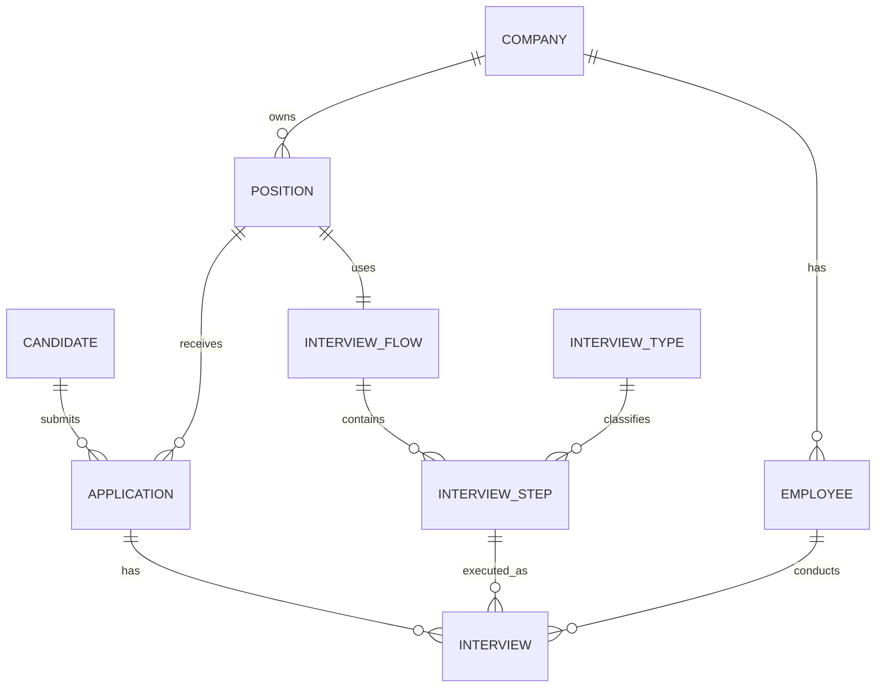

## 1. Resumen ejecutivo
- **Veredicto:** **no está listo para producción** para el flujo end-to-end de un ATS SaaS multi-tenant. Soporta el caso feliz básico, pero se rompe en re-aplicaciones, re-entrevistas, panel interviews, auditoría y versionado de flujos.
- **Bloqueadores funcionales principales:** `UNIQUE (position_id, candidate_id)` impide re-aplicar; `UNIQUE (application_id, interview_step_id)` impide repetir un step; `employee_id` único por entrevista impide panel; no existe historial de cambios ni estado actual persistido del funnel.
- **Bloqueador arquitectónico principal:** el flujo de entrevistas **no está versionado ni snapshoteado**; si cambias `interview_step`, alteras implícitamente aplicaciones en curso.
- **Bloqueador de compliance:** `ON DELETE CASCADE` desde `company`, `position` y `candidate` destruye historial operativo y de auditoría, justo lo contrario de lo que pide un ATS serio.
- **Bloqueador de multi-tenancy:** el tenant está modelado de forma implícita y parcial; no hay `company_id` propagado ni restricciones que eviten cruzar empleados de una compañía con aplicaciones de otra.

## 2. Modelo conceptual reconocido
**Entidades principales y rol**
- `company`: tenant cliente.
- `employee`: usuario interno del tenant.
- `interview_flow`: definición del flujo.
- `interview_step`: steps ordenados del flujo.
- `interview_type`: catálogo de tipos de entrevista.
- `position`: vacante publicada por compañía.
- `candidate`: perfil global del postulante.
- `application`: intento de un candidato de aplicar a una posición.
- `interview`: ejecución de un step por un entrevistador.

**Relaciones**
- `company 1:N employee`
- `company 1:N position`
- `position 1:1 interview_flow` por `position.interview_flow_id UNIQUE`
- `interview_flow 1:N interview_step`
- `interview_type 1:N interview_step`
- `candidate 1:N application`
- `position 1:N application`
- `application 1:N interview` en teoría, pero limitado por `UNIQUE (application_id, interview_step_id)`
- `employee 1:N interview`



**Patrones detectados**
- Catálogo: `interview_type`.
- Flujo configurable lineal: `interview_flow` + `interview_step(order_index)`.
- Entidad asociativa: `application` entre `candidate` y `position`.
- Modelo transaccional simple, pero **sin event history ni state machine explícita**.

## 3. Validación del flujo end-to-end ⭐
**1. Publicación de posición**
- **¿Lo soporta?** ⚠️ Parcial
- **Evidencia técnica:** `position.company_id`, `position.interview_flow_id`, `interview_step.order_index` y `interview_type_id` sí modelan vacante + flujo + steps ordenados. Ver [`position`](</Users/waltercordero/AI4Devs/Ai4Devs-Modelo-de-datos-LTI-2026-03-senior/backend/prisma/recruitment_schema.sql:30>) y [`interview_step`](</Users/waltercordero/AI4Devs/Ai4Devs-Modelo-de-datos-LTI-2026-03-senior/backend/prisma/recruitment_schema.sql:65>).
- **Gap encontrado:** no hay asignación de entrevistadores por step; `position.interview_flow_id UNIQUE` fuerza 1:1 y no permite reutilizar un flujo entre posiciones.
- **Workaround actual vs solución correcta:** hoy duplicarías flows por posición; lo correcto es flow reusable/versionado y una tabla de asignables por step.

**2. Descubrimiento y aplicación a múltiples posiciones**
- **¿Lo soporta?** ⚠️ Parcial
- **Evidencia técnica:** `candidate` se reutiliza vía `application(candidate_id, position_id)`, así que un candidato sí puede aplicar a varias posiciones e incluso a varias compañías. `candidate.email UNIQUE` favorece perfil global.
- **Gap encontrado:** `UNIQUE (position_id, candidate_id)` bloquea re-aplicar a la misma posición. Ver [`uq_application_candidate_position`](</Users/waltercordero/AI4Devs/Ai4Devs-Modelo-de-datos-LTI-2026-03-senior/backend/prisma/recruitment_schema.sql:107>).
- **Workaround actual vs solución correcta:** reabrir la misma fila mezclando intentos; lo correcto es modelar `attempt_no` y una única aplicación abierta por candidato/posición.

**3. Triage inicial**
- **¿Lo soporta?** ⚠️ Parcial
- **Evidencia técnica:** `application.status` permite un estado inicial; la aplicación hereda el flujo solo indirectamente por `application.position_id -> position.interview_flow_id`.
- **Gap encontrado:** no existe snapshot del flujo al aplicar ni `current_step`; si cambias el flujo de la posición, las aplicaciones en curso quedan semánticamente huérfanas.
- **Workaround actual vs solución correcta:** recomputar contra el flujo vivo; lo correcto es congelar `interview_flow_id/version` en `application` y snapshote ar sus steps.

**4. Avance step-by-step**
- **¿Lo soporta?** ⚠️ Parcial
- **Evidencia técnica:** `interview.result`, `score`, `notes` capturan evaluación básica.
- **Gap encontrado:** `UNIQUE (application_id, interview_step_id)` impide repetir un step; `employee_id NOT NULL` en `interview` impide panel interviews. Ver [`interview`](</Users/waltercordero/AI4Devs/Ai4Devs-Modelo-de-datos-LTI-2026-03-senior/backend/prisma/recruitment_schema.sql:111>).
- **Workaround actual vs solución correcta:** duplicar steps o sobrescribir entrevistas; lo correcto es separar `interview_session` de `interview_session_interviewer`.

**5. Decisiones intermedias**
- **¿Lo soporta?** ❌ No
- **Evidencia técnica:** no hay historial de status ni de step, no hay `scheduled_at` vs `completed_at`, no hay tabla de reasignación, no hay actor ni motivo.
- **Gap encontrado:** rechazo, pausa, reprogramación, repetición, skip y reassignment solo pueden modelarse pisando filas.
- **Workaround actual vs solución correcta:** escribir texto en `notes`; lo correcto es `application_status_history` + `interview_session` + historial de asignaciones.

**6. Decisión final**
- **¿Lo soporta?** ⚠️ Parcial
- **Evidencia técnica:** `application.status` podría guardar `hired/rejected`.
- **Gap encontrado:** falta `decided_at`, `decided_by_employee_id`, `decision_reason`; no existe entidad `offer`.
- **Workaround actual vs solución correcta:** guardar todo en `status`/`notes`; lo correcto es persistir metadatos de decisión y, si habrá oferta formal, una tabla `offer`.

**7. Consultas operativas críticas**
- **¿Lo soporta?** ⚠️ Parcial
- **Evidencia técnica:** hay índices básicos por FKs, pero no por consultas reales de funnel. Ver índices en [`recruitment_schema.sql`](</Users/waltercordero/AI4Devs/Ai4Devs-Modelo-de-datos-LTI-2026-03-senior/backend/prisma/recruitment_schema.sql:138>).
- **Gap encontrado:** no puedes saber el step actual sin recomputar; no puedes medir `time-to-hire` confiable sin timestamps terminales; no puedes saber pendientes semanales por entrevistador sin estado horario.
- **Workaround actual vs solución correcta:** queries con `MAX(order_index)` y `result IS NULL`; lo correcto es persistir `current_step`, `status_changed_at`, `scheduled_start_at`, `completed_at` e índices compuestos/partiales.

**8. Reapertura y re-aplicación**
- **¿Lo soporta?** ❌ No
- **Evidencia técnica:** `UNIQUE (position_id, candidate_id)` lo bloquea de raíz.
- **Gap encontrado:** no existe concepto de nuevo intento ni vínculo con intentos previos.
- **Workaround actual vs solución correcta:** reciclar la misma `application`; lo correcto es múltiples intentos con `attempt_no`, `previous_application_id` y regla de “una abierta a la vez”.

## 4. Fortalezas del diseño actual
1. La relación `candidate -> application -> position` sí reutiliza el perfil del candidato entre posiciones, que es la base correcta para un ATS.
2. `interview_step(order_index)` con unicidad por flujo impone orden lineal y evita steps duplicados.
3. Hay integridad referencial básica en todas las relaciones principales.
4. `chk_position_salary` y `chk_interview_score` muestran una intención sana de validación a nivel DB.
5. Separar `interview_type` como catálogo evita hardcodear tipos dentro de `interview_step`.

## 5. Debilidades, riesgos y code smells
1. **Hallazgo:** `UNIQUE (position_id, candidate_id)` bloquea reaplicaciones. **Severidad:** 🔴 Crítico. **Impacto:** punto 8. **Categoría:** Modelado.
2. **Hallazgo:** `UNIQUE (application_id, interview_step_id)` bloquea re-entrevistas legítimas. **Severidad:** 🔴 Crítico. **Impacto:** puntos 4 y 5. **Categoría:** Modelado.
3. **Hallazgo:** `interview.employee_id` impone un solo entrevistador por entrevista. **Severidad:** 🔴 Crítico. **Impacto:** punto 4. **Categoría:** Modelado.
4. **Hallazgo:** no hay versionado ni snapshot de `interview_flow`; editar un flujo afecta aplicaciones en curso. **Severidad:** 🔴 Crítico. **Impacto:** puntos 3, 4 y 5. **Categoría:** Integridad.
5. **Hallazgo:** no existe historial de estados ni actor de cambios. **Severidad:** 🔴 Crítico. **Impacto:** puntos 5, 6 y 7. **Categoría:** Auditoría.
6. **Hallazgo:** no hay `created_at`, `updated_at`, `deleted_at`; además `application_date` e `interview_date` son `DATE`, no `TIMESTAMPTZ`. **Severidad:** 🟠 Alto. **Impacto:** puntos 5, 6 y 7. **Categoría:** Auditoría.
7. **Hallazgo:** estados en `VARCHAR` (`position.status`, `application.status`, `interview.result`) permiten drift semántico y analytics inconsistentes. **Severidad:** 🟠 Alto. **Impacto:** puntos 3, 5, 6 y 7. **Categoría:** Integridad.
8. **Hallazgo:** multi-tenancy implícita; `company_id` no está en `application`, `interview`, `interview_flow`; tampoco hay RLS. Peor aún, hoy puedes enlazar una `application` de Company A con un `employee` de Company B sin que la DB lo impida. **Severidad:** 🔴 Crítico. **Impacto:** todos. **Categoría:** Multi-tenancy.
9. **Hallazgo:** `ON DELETE CASCADE` desde `company`, `position` y `candidate` destruye historial. **Severidad:** 🔴 Crítico. **Impacto:** puntos 6 y 7. **Categoría:** Auditoría.
10. **Hallazgo:** `position.interview_flow_id UNIQUE` acopla posición y flujo en 1:1, impidiendo reutilización y encareciendo mantenimiento. **Severidad:** 🟠 Alto. **Impacto:** punto 1. **Categoría:** Mantenibilidad.
11. **Hallazgo:** faltan índices compuestos para funnel, step actual, time-to-hire y agenda semanal. **Severidad:** 🟠 Alto. **Impacto:** punto 7. **Categoría:** Performance.
12. **Hallazgo:** faltan constraints de negocio: coherencia temporal, moneda de salario, timezone, validación más estricta de email/phone, y `employee.email UNIQUE` global puede romper escenarios multi-tenant reales. **Severidad:** 🟡 Medio. **Impacto:** puntos 1, 6 y 7. **Categoría:** Integridad.
13. **Hallazgo:** `order_index` modela solo flujo lineal; no soporta steps opcionales/paralelos ni fast-track limpio. **Severidad:** 🟠 Alto. **Impacto:** puntos 5 y 7. **Categoría:** Modelado.
14. **Hallazgo:** el schema Prisma no modela estas tablas ATS, solo `Candidate` y CV-related objects en [`schema.prisma`](</Users/waltercordero/AI4Devs/Ai4Devs-Modelo-de-datos-LTI-2026-03-senior/backend/prisma/schema.prisma:17>). **Severidad:** 🟡 Medio. **Impacto:** evolución y migraciones. **Categoría:** Mantenibilidad.

## 6. Mejoras propuestas (con DDL)
**1. Multi-tenancy explícito + reutilización/versionado básico de flow**
- **Problema que resuelve:** puntos 1, 3, 7.
- **Trade-off:** más columnas y FKs; a cambio obtienes aislamiento de tenant y base para versionar sin reescribir todo.

```sql
ALTER TABLE interview_flow
  ADD COLUMN IF NOT EXISTS company_id INT,
  ADD COLUMN IF NOT EXISTS root_flow_id INT,
  ADD COLUMN IF NOT EXISTS version_no INT NOT NULL DEFAULT 1,
  ADD COLUMN IF NOT EXISTS created_at TIMESTAMPTZ NOT NULL DEFAULT now();

UPDATE interview_flow f
SET company_id = p.company_id,
    root_flow_id = f.id
FROM position p
WHERE p.interview_flow_id = f.id
  AND (f.company_id IS NULL OR f.root_flow_id IS NULL);

ALTER TABLE interview_flow
  ALTER COLUMN company_id SET NOT NULL,
  ALTER COLUMN root_flow_id SET NOT NULL;

ALTER TABLE interview_flow
  ADD CONSTRAINT fk_interview_flow_company
    FOREIGN KEY (company_id) REFERENCES company(id) ON DELETE RESTRICT,
  ADD CONSTRAINT fk_interview_flow_root
    FOREIGN KEY (root_flow_id) REFERENCES interview_flow(id) ON DELETE RESTRICT,
  ADD CONSTRAINT uq_interview_flow_root_version
    UNIQUE (root_flow_id, version_no);

ALTER TABLE position
  DROP CONSTRAINT IF EXISTS position_interview_flow_id_key;

ALTER TABLE application
  ADD COLUMN IF NOT EXISTS company_id INT,
  ADD COLUMN IF NOT EXISTS interview_flow_id INT;

UPDATE application a
SET company_id = p.company_id,
    interview_flow_id = p.interview_flow_id
FROM position p
WHERE p.id = a.position_id
  AND (a.company_id IS NULL OR a.interview_flow_id IS NULL);

ALTER TABLE application
  ALTER COLUMN company_id SET NOT NULL,
  ALTER COLUMN interview_flow_id SET NOT NULL;

ALTER TABLE application
  ADD CONSTRAINT fk_application_company
    FOREIGN KEY (company_id) REFERENCES company(id) ON DELETE RESTRICT,
  ADD CONSTRAINT fk_application_flow
    FOREIGN KEY (interview_flow_id) REFERENCES interview_flow(id) ON DELETE RESTRICT;
```

**2. Snapshot del flujo al momento de aplicar**
- **Problema que resuelve:** puntos 3, 4, 5.
- **Trade-off:** duplica metadata por aplicación; a cambio congelas el flujo histórico y dejas de romper procesos activos al editar plantillas.

```sql
CREATE TABLE application_flow_snapshot (
  id BIGSERIAL PRIMARY KEY,
  application_id INT NOT NULL UNIQUE,
  company_id INT NOT NULL,
  source_position_id INT NOT NULL,
  source_interview_flow_id INT NOT NULL,
  source_flow_root_id INT NOT NULL,
  source_flow_version_no INT NOT NULL,
  captured_at TIMESTAMPTZ NOT NULL DEFAULT now(),
  created_by_employee_id INT,
  FOREIGN KEY (application_id) REFERENCES application(id) ON DELETE CASCADE,
  FOREIGN KEY (company_id) REFERENCES company(id) ON DELETE RESTRICT,
  FOREIGN KEY (source_position_id) REFERENCES position(id) ON DELETE RESTRICT,
  FOREIGN KEY (source_interview_flow_id) REFERENCES interview_flow(id) ON DELETE RESTRICT,
  FOREIGN KEY (created_by_employee_id) REFERENCES employee(id) ON DELETE RESTRICT
);

CREATE TABLE application_flow_step_snapshot (
  id BIGSERIAL PRIMARY KEY,
  application_flow_snapshot_id BIGINT NOT NULL,
  source_interview_step_id INT,
  interview_type_id INT NOT NULL,
  step_name VARCHAR(255) NOT NULL,
  order_index INT NOT NULL,
  is_optional BOOLEAN NOT NULL DEFAULT FALSE,
  created_at TIMESTAMPTZ NOT NULL DEFAULT now(),
  FOREIGN KEY (application_flow_snapshot_id) REFERENCES application_flow_snapshot(id) ON DELETE CASCADE,
  FOREIGN KEY (source_interview_step_id) REFERENCES interview_step(id) ON DELETE RESTRICT,
  FOREIGN KEY (interview_type_id) REFERENCES interview_type(id) ON DELETE RESTRICT,
  CONSTRAINT uq_application_flow_step_snapshot_order
    UNIQUE (application_flow_snapshot_id, order_index)
);
```

**3. Estado actual persistido + audit trail del funnel**
- **Problema que resuelve:** puntos 3, 5, 6, 7.
- **Trade-off:** más escritura por transición; a cambio consultas operativas simples y trazabilidad real.

```sql
DO $$ BEGIN
  CREATE TYPE application_status AS ENUM
    ('applied','in_review','interviewing','on_hold','offer','hired','rejected','withdrawn','closed');
EXCEPTION WHEN duplicate_object THEN NULL; END $$;

ALTER TABLE application
  ADD COLUMN IF NOT EXISTS applied_at TIMESTAMPTZ,
  ADD COLUMN IF NOT EXISTS status_code application_status,
  ADD COLUMN IF NOT EXISTS current_step_snapshot_id BIGINT,
  ADD COLUMN IF NOT EXISTS status_changed_at TIMESTAMPTZ NOT NULL DEFAULT now(),
  ADD COLUMN IF NOT EXISTS decided_at TIMESTAMPTZ,
  ADD COLUMN IF NOT EXISTS decided_by_employee_id INT,
  ADD COLUMN IF NOT EXISTS decision_reason TEXT,
  ADD COLUMN IF NOT EXISTS closed_at TIMESTAMPTZ;

UPDATE application
SET applied_at = application_date::timestamptz
WHERE applied_at IS NULL;

UPDATE application
SET status_code = CASE lower(status)
  WHEN 'applied' THEN 'applied'::application_status
  WHEN 'screening' THEN 'in_review'::application_status
  WHEN 'interviewing' THEN 'interviewing'::application_status
  WHEN 'on_hold' THEN 'on_hold'::application_status
  WHEN 'offer' THEN 'offer'::application_status
  WHEN 'hired' THEN 'hired'::application_status
  WHEN 'rejected' THEN 'rejected'::application_status
  WHEN 'withdrawn' THEN 'withdrawn'::application_status
  ELSE 'applied'::application_status
END
WHERE status_code IS NULL;

ALTER TABLE application
  ALTER COLUMN applied_at SET NOT NULL,
  ALTER COLUMN status_code SET NOT NULL;

ALTER TABLE application
  ADD CONSTRAINT fk_application_current_step_snapshot
    FOREIGN KEY (current_step_snapshot_id) REFERENCES application_flow_step_snapshot(id) ON DELETE RESTRICT,
  ADD CONSTRAINT fk_application_decider
    FOREIGN KEY (decided_by_employee_id) REFERENCES employee(id) ON DELETE RESTRICT;

CREATE TABLE application_status_history (
  id BIGSERIAL PRIMARY KEY,
  application_id INT NOT NULL,
  company_id INT NOT NULL,
  from_status application_status,
  to_status application_status NOT NULL,
  from_step_snapshot_id BIGINT,
  to_step_snapshot_id BIGINT,
  changed_by_employee_id INT,
  change_reason TEXT,
  changed_at TIMESTAMPTZ NOT NULL DEFAULT now(),
  FOREIGN KEY (application_id) REFERENCES application(id) ON DELETE CASCADE,
  FOREIGN KEY (company_id) REFERENCES company(id) ON DELETE RESTRICT,
  FOREIGN KEY (from_step_snapshot_id) REFERENCES application_flow_step_snapshot(id) ON DELETE RESTRICT,
  FOREIGN KEY (to_step_snapshot_id) REFERENCES application_flow_step_snapshot(id) ON DELETE RESTRICT,
  FOREIGN KEY (changed_by_employee_id) REFERENCES employee(id) ON DELETE RESTRICT
);
```

**4. Reaplicación después de rechazo conservando historial**
- **Problema que resuelve:** punto 8.
- **Trade-off:** introduces concepto de intento; a cambio dejas de mezclar ciclos distintos en una sola fila.

```sql
ALTER TABLE application
  ADD COLUMN IF NOT EXISTS attempt_no INT NOT NULL DEFAULT 1,
  ADD COLUMN IF NOT EXISTS previous_application_id INT,
  ADD CONSTRAINT fk_application_previous
    FOREIGN KEY (previous_application_id) REFERENCES application(id) ON DELETE RESTRICT;

ALTER TABLE application
  DROP CONSTRAINT IF EXISTS uq_application_candidate_position;

CREATE UNIQUE INDEX uq_application_candidate_position_attempt
  ON application (position_id, candidate_id, attempt_no);

CREATE UNIQUE INDEX uq_application_open_per_candidate_position
  ON application (position_id, candidate_id)
  WHERE closed_at IS NULL;
```

**5. Panel interviews + re-entrevistas + reasignación con historial**
- **Problema que resuelve:** puntos 4, 5, 7.
- **Trade-off:** sustituyes una tabla simple por dos tablas más expresivas; a cambio modelas la realidad operativa en vez de pelearte con ella.

```sql
DO $$ BEGIN
  CREATE TYPE interview_session_status AS ENUM ('scheduled','completed','cancelled','no_show');
EXCEPTION WHEN duplicate_object THEN NULL; END $$;

DO $$ BEGIN
  CREATE TYPE interview_outcome AS ENUM ('pending','strong_yes','yes','mixed','no','strong_no','pass','fail');
EXCEPTION WHEN duplicate_object THEN NULL; END $$;

CREATE TABLE interview_session (
  id BIGSERIAL PRIMARY KEY,
  application_id INT NOT NULL,
  company_id INT NOT NULL,
  step_snapshot_id BIGINT NOT NULL,
  round_no INT NOT NULL DEFAULT 1,
  status interview_session_status NOT NULL DEFAULT 'scheduled',
  scheduled_start_at TIMESTAMPTZ,
  scheduled_end_at TIMESTAMPTZ,
  completed_at TIMESTAMPTZ,
  overall_outcome interview_outcome,
  overall_score INT,
  notes TEXT,
  created_at TIMESTAMPTZ NOT NULL DEFAULT now(),
  updated_at TIMESTAMPTZ NOT NULL DEFAULT now(),
  created_by_employee_id INT,
  CONSTRAINT fk_interview_session_application FOREIGN KEY (application_id) REFERENCES application(id) ON DELETE CASCADE,
  CONSTRAINT fk_interview_session_company FOREIGN KEY (company_id) REFERENCES company(id) ON DELETE RESTRICT,
  CONSTRAINT fk_interview_session_step FOREIGN KEY (step_snapshot_id) REFERENCES application_flow_step_snapshot(id) ON DELETE RESTRICT,
  CONSTRAINT fk_interview_session_creator FOREIGN KEY (created_by_employee_id) REFERENCES employee(id) ON DELETE RESTRICT,
  CONSTRAINT uq_interview_session_round UNIQUE (application_id, step_snapshot_id, round_no),
  CONSTRAINT chk_interview_session_score CHECK (overall_score IS NULL OR overall_score BETWEEN 0 AND 100),
  CONSTRAINT chk_interview_session_time CHECK (
    scheduled_end_at IS NULL OR scheduled_start_at IS NULL OR scheduled_end_at > scheduled_start_at
  )
);

ALTER TABLE employee
  ADD CONSTRAINT uq_employee_id_company UNIQUE (id, company_id);

ALTER TABLE interview_session
  ADD CONSTRAINT uq_interview_session_id_company UNIQUE (id, company_id);

CREATE TABLE interview_session_interviewer (
  id BIGSERIAL PRIMARY KEY,
  interview_session_id BIGINT NOT NULL,
  company_id INT NOT NULL,
  employee_id INT NOT NULL,
  assigned_by_employee_id INT,
  assignment_started_at TIMESTAMPTZ NOT NULL DEFAULT now(),
  assignment_ended_at TIMESTAMPTZ,
  individual_outcome interview_outcome,
  individual_score INT,
  notes TEXT,
  FOREIGN KEY (interview_session_id, company_id) REFERENCES interview_session(id, company_id) ON DELETE CASCADE,
  FOREIGN KEY (employee_id, company_id) REFERENCES employee(id, company_id) ON DELETE RESTRICT,
  FOREIGN KEY (assigned_by_employee_id) REFERENCES employee(id) ON DELETE RESTRICT,
  CONSTRAINT chk_interview_session_interviewer_score CHECK (
    individual_score IS NULL OR individual_score BETWEEN 0 AND 100
  )
);

CREATE UNIQUE INDEX uq_interview_session_interviewer_active
  ON interview_session_interviewer (interview_session_id, employee_id)
  WHERE assignment_ended_at IS NULL;
```

**6. Auditoría base + borrar sin perder historia**
- **Problema que resuelve:** puntos 6 y 7.
- **Trade-off:** cambia semántica de borrado; a cambio conservas compliance y analytics.

```sql
CREATE OR REPLACE FUNCTION set_updated_at()
RETURNS trigger
LANGUAGE plpgsql
AS $$
BEGIN
  NEW.updated_at = now();
  RETURN NEW;
END;
$$;

ALTER TABLE company   ADD COLUMN IF NOT EXISTS created_at TIMESTAMPTZ NOT NULL DEFAULT now(), ADD COLUMN IF NOT EXISTS updated_at TIMESTAMPTZ NOT NULL DEFAULT now(), ADD COLUMN IF NOT EXISTS deleted_at TIMESTAMPTZ;
ALTER TABLE employee  ADD COLUMN IF NOT EXISTS created_at TIMESTAMPTZ NOT NULL DEFAULT now(), ADD COLUMN IF NOT EXISTS updated_at TIMESTAMPTZ NOT NULL DEFAULT now(), ADD COLUMN IF NOT EXISTS deleted_at TIMESTAMPTZ;
ALTER TABLE position  ADD COLUMN IF NOT EXISTS created_at TIMESTAMPTZ NOT NULL DEFAULT now(), ADD COLUMN IF NOT EXISTS updated_at TIMESTAMPTZ NOT NULL DEFAULT now(), ADD COLUMN IF NOT EXISTS deleted_at TIMESTAMPTZ;
ALTER TABLE candidate ADD COLUMN IF NOT EXISTS created_at TIMESTAMPTZ NOT NULL DEFAULT now(), ADD COLUMN IF NOT EXISTS updated_at TIMESTAMPTZ NOT NULL DEFAULT now(), ADD COLUMN IF NOT EXISTS deleted_at TIMESTAMPTZ;

DROP TRIGGER IF EXISTS trg_company_updated_at ON company;
DROP TRIGGER IF EXISTS trg_employee_updated_at ON employee;
DROP TRIGGER IF EXISTS trg_position_updated_at ON position;
DROP TRIGGER IF EXISTS trg_candidate_updated_at ON candidate;

CREATE TRIGGER trg_company_updated_at  BEFORE UPDATE ON company   FOR EACH ROW EXECUTE FUNCTION set_updated_at();
CREATE TRIGGER trg_employee_updated_at BEFORE UPDATE ON employee  FOR EACH ROW EXECUTE FUNCTION set_updated_at();
CREATE TRIGGER trg_position_updated_at BEFORE UPDATE ON position  FOR EACH ROW EXECUTE FUNCTION set_updated_at();
CREATE TRIGGER trg_candidate_updated_at BEFORE UPDATE ON candidate FOR EACH ROW EXECUTE FUNCTION set_updated_at();

ALTER TABLE employee    DROP CONSTRAINT fk_employee_company;
ALTER TABLE position    DROP CONSTRAINT fk_position_company;
ALTER TABLE application DROP CONSTRAINT fk_application_position;
ALTER TABLE application DROP CONSTRAINT fk_application_candidate;

ALTER TABLE employee
  ADD CONSTRAINT fk_employee_company
    FOREIGN KEY (company_id) REFERENCES company(id) ON DELETE RESTRICT;

ALTER TABLE position
  ADD CONSTRAINT fk_position_company
    FOREIGN KEY (company_id) REFERENCES company(id) ON DELETE RESTRICT;

ALTER TABLE application
  ADD CONSTRAINT fk_application_position
    FOREIGN KEY (position_id) REFERENCES position(id) ON DELETE RESTRICT,
  ADD CONSTRAINT fk_application_candidate
    FOREIGN KEY (candidate_id) REFERENCES candidate(id) ON DELETE RESTRICT;
```

**7. Índices para queries operativas críticas**
- **Problema que resuelve:** punto 7.
- **Trade-off:** más costo de escritura; a cambio latencia estable en dashboard, agenda y analytics operativos.

```sql
CREATE INDEX IF NOT EXISTS idx_application_company_position_status_step_open
  ON application (company_id, position_id, status_code, current_step_snapshot_id)
  WHERE closed_at IS NULL;

CREATE INDEX IF NOT EXISTS idx_application_candidate_applied_at
  ON application (candidate_id, applied_at DESC);

CREATE INDEX IF NOT EXISTS idx_application_position_hired
  ON application (position_id, decided_at)
  WHERE status_code = 'hired';

CREATE INDEX IF NOT EXISTS idx_application_status_history_app_changed_at
  ON application_status_history (application_id, changed_at DESC);

CREATE INDEX IF NOT EXISTS idx_interview_session_company_schedule
  ON interview_session (company_id, scheduled_start_at, status);

CREATE INDEX IF NOT EXISTS idx_interview_session_interviewer_pending
  ON interview_session_interviewer (company_id, employee_id, interview_session_id)
  WHERE assignment_ended_at IS NULL;
```

## 7. Casos de uso edge no soportados
- **Reapertura de aplicaciones rechazadas:** hoy obliga a reciclar la misma `application` o romper la unicidad.
- **Re-entrevistas en el mismo step:** hoy quedan bloqueadas por `UNIQUE (application_id, interview_step_id)`.
- **Panel interviews:** hoy no caben porque `interview` solo admite un `employee_id`.
- **Reasignación de entrevistador con historial:** hoy solo puedes hacer `UPDATE employee_id` y perder trazabilidad.
- **Candidato aplicando a múltiples posiciones de la misma compañía:** sí soportado, pero sin historial de estado/step confiable.
- **Candidato aplicando a compañías distintas:** sí soportado a nivel relacional, pero con riesgo serio de aislamiento de datos.
- **Flows con steps paralelos u opcionales:** no soportados; `order_index` modela una sola secuencia lineal.
- **Versionado del flow con aplicaciones en curso:** no soportado; editar el flow vivo cambia semántica histórica.
- **Borrado de compañía:** hoy potencialmente arrasa posiciones, aplicaciones y parte del historial.
- **Saltar un step:** no hay representación explícita de skip autorizado ni motivo.

## 8. Preguntas de discovery para Product/Stakeholders
1. ¿Una reaplicación debe crear un nuevo intento independiente o reabrir la misma aplicación?
2. ¿Permitimos más de una aplicación abierta simultáneamente para el mismo candidato y posición?
3. ¿Cuando cambia un `interview_flow`, las aplicaciones activas permanecen en la versión original o migran?
4. ¿Un mismo flow debe poder reutilizarse entre múltiples posiciones de la misma compañía?
5. ¿Los entrevistadores siempre pertenecen a la compañía dueña de la posición, o existirán externos/contractors?
6. ¿Un panel interview produce una decisión agregada, decisiones individuales, o ambas?
7. ¿Qué estados terminales y transiciones son válidos exactamente para `application`?
8. ¿Necesitan auditar quién cambió estado/step, cuándo y con qué motivo para compliance?
9. ¿Debe existir un objeto `offer` separado de `application`, con aprobaciones, versión y expiración?
10. ¿El candidato es una identidad global cross-company por diseño de producto, o cada tenant debe verlo como aislado?
11. ¿Se permiten steps opcionales, paralelos, repetibles o skipeables por fast-track/referrals?
12. ¿Qué política legal aplica para borrado/anonymización de PII sin perder métricas ni trazabilidad operativa?

## 9. Tu opinión profesional (sin filtros)
**No**, este esquema **no soporta bien** el flujo end-to-end de aplicación a múltiples posiciones en producción. Soporta el demo feliz; no soporta la operación real de un ATS con reintentos, paneles, auditoría, multi-tenancy y cambios de flujo sin romper históricos.

Si lo reconstruyera hoy, haría tres cosas radicalmente distinto:
1. Trataría `application` como **aggregate root del proceso**, con estado actual persistido e historial de transiciones.
2. Haría el flujo **versionado e inmutable por aplicación**, con snapshot de steps al momento de aplicar.
3. Separaría **sesión de entrevista** de **participantes/evaluaciones**, para soportar paneles, re-entrevistas y reasignaciones sin hacks.

El riesgo técnico que más me preocupa en día 1 con miles de aplicaciones simultáneas no es performance: es **corrupción semántica del proceso**. Vas a tener candidatos en estados ambiguos, históricos alterados por cambios de flow, entrevistas sobrescritas y dashboards que “parecen” correctos pero mienten. Ese tipo de deuda en un ATS destruye confianza operativa muy rápido.